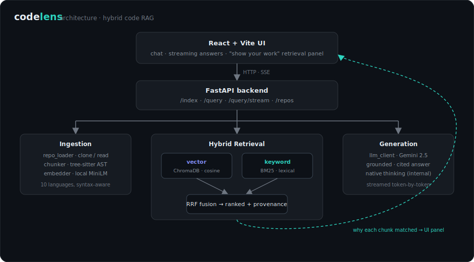

# CodeLens — RAG-based Codebase Q&A

CodeLens indexes a GitHub repository or local codebase and lets you ask natural-language questions about it, returning answers grounded in the actual code with file/line citations.

It uses **local embeddings** for retrieval (your code is embedded on your machine) and **Google Gemini** for answer generation. Retrieval is **hybrid** — dense vector search fused with BM25 keyword search via Reciprocal Rank Fusion — and source files are chunked along **syntax boundaries** (functions, classes, structs, interfaces…) using tree-sitter across all supported languages.

What sets it apart from a generic RAG demo: every answer **shows its work**. The UI surfaces exactly which code chunks were retrieved and *why* — whether each one came from semantic (vector) or keyword (BM25) search, its BM25 score, its dense rank, and the fused RRF score. CodeLens is meant to be a tool you can *learn retrieval from*, not just query.

## Highlights

- **Hybrid retrieval** — dense (ChromaDB cosine) + sparse (BM25) fused with Reciprocal Rank Fusion.
- **"Show your work" panel** — per-chunk provenance: `vector` vs `keyword` match, BM25 score, dense rank, RRF score, AST node type.
- **Syntax-aware chunking** — tree-sitter AST chunks (functions, classes, structs…) across 10 languages, with a sliding-window fallback.
- **Multi-repo** — index many repositories, each in its own collection, switchable from the sidebar.
- **Async indexing** with live progress, **streamed** answers (SSE), and **grounded** citations.
- **Local-first embeddings** (your code never leaves the machine for retrieval); only the final prompt goes to Gemini.
- **Polished UI** — minimal IDE/terminal aesthetic with a persisted light/dark theme.

## Architecture

<p align="center"></p>

| Concern | Implementation |
|---|---|
| Embeddings | `sentence-transformers` (local, default `all-MiniLM-L6-v2`) |
| Vector store | ChromaDB (persistent, on disk) |
| Keyword search | `rank_bm25` (BM25Okapi), fused with dense results via RRF |
| Chunking | tree-sitter AST chunking for all supported languages (definition-level chunks + module-level gaps), sliding-window fallback for anything without a grammar |
| LLM | Google Gemini (default `gemini-2.5-flash`) |
| Backend | FastAPI + Uvicorn |
| Frontend | React + Vite + Tailwind (primary); Streamlit (optional) |

## Prerequisites

- Python 3.10+
- Node.js 18+ (for the React UI)
- A **Google Gemini API key** — https://aistudio.google.com/app/apikey

> Note: answer generation uses the Gemini cloud API, so a key and network access are required. Embeddings and retrieval run locally.

## Setup

### 1. Backend

```bash
# from the repo root
uv sync                 # or: python -m venv .venv && pip install -r requirements.txt

cp .env.example .env    # then edit .env and set GEMINI_API_KEY
```

Start the API:

```bash
uv run uvicorn src.api.main:app --reload --port 8000
```

The API serves:
- `GET  /health` — status + repo/chunk counts (unauthenticated)
- `POST /api/v1/rag/index` — start indexing a repo (`{"repo_input": "<github-url-or-local-path>"}`), returns immediately with status `indexing`
- `GET  /api/v1/rag/repos` — list indexed repos and their status
- `DELETE /api/v1/rag/repos/{repo_id}` — delete a repo's index
- `POST /api/v1/rag/query` — ask a question (`{"repo_id": "...", "query": "...", "conversation_history": [...], "language_filter": "python"}`). Returns the answer plus `sources[]`, each carrying retrieval **provenance** (see below).
- `POST /api/v1/rag/query/stream` — same, but streams the answer as Server-Sent Events (a `sources` frame first, then `token` frames)

Each source in the response includes a `retrieval` object explaining *why* it surfaced:

```jsonc
{
  "file_path": "src/requests/sessions.py",
  "start_line": 301, "end_line": 340,
  "chunk_type": "class", "language": "python",
  "similarity": 0.0322,            // == retrieval.rrf_score (kept for back-compat)
  "retrieval": {
    "matched_by": ["vector", "keyword"], // which retriever(s) hit it
    "dense_rank": 2,                       // rank in vector results (null if keyword-only)
    "bm25_score": 7.28,                    // raw BM25 score (null if vector-only)
    "rrf_score": 0.0322,                   // fused reciprocal-rank-fusion score
    "rank": 0                              // final fused rank
  }
}
```

When `API_KEY` is set, all `/api/v1/rag/*` routes require an `X-API-Key` header.

### 2. Frontend (React)

```bash
cd codelens-ui
npm install
npm run dev             # opens http://localhost:5173
```

### Alternative: Streamlit UI

```bash
uv run streamlit run src/app.py
```

Both frontends talk to the same FastAPI backend on port 8000.

## Deployment (Docker)

The repo ships a backend image, an nginx-served frontend image, and a Compose
file that wires them together with a persistent volume for the vector store.

```bash
cp .env.example .env          # set GEMINI_API_KEY (and optionally API_KEY)
docker compose up --build
```

- Frontend: http://localhost:8080
- Backend API: http://localhost:8000

Notes:
- The backend's first boot downloads the embedding model, so the container's
  healthcheck has a generous `start_period`.
- The frontend bakes its backend URL at build time via the `VITE_API_URL` build
  arg (default `http://localhost:8000`); set it for non-local deployments.
- Indexed data persists in the `codelens-data` volume.
- If `API_KEY` is set in `.env`, also pass `VITE_API_KEY` as a frontend build arg
  so the UI can authenticate.

## Configuration

All settings are read from `.env` (see `.env.example`):

| Variable | Default | Purpose |
|---|---|---|
| `GEMINI_API_KEY` | — | **Required.** Gemini API key for generation |
| `API_KEY` | _(empty)_ | If set, `/api/v1/rag/*` requires a matching `X-API-Key` header |
| `LLM_MODEL` | `gemini-2.5-flash` | Gemini model |
| `EMBEDDING_MODEL` | `all-MiniLM-L6-v2` | Local sentence-transformers model |
| `CHROMA_PERSIST_DIR` | `./data/chroma_db` | Vector DB location |
| `MAX_CHUNK_SIZE` | `1500` | Max chunk size (chars) |
| `CHUNK_OVERLAP` | `200` | Sliding-window overlap (chars) |
| `RETRIEVAL_TOP_K` | `5` | Chunks retrieved per query |
| `CORS_ORIGINS` | `localhost:5173,3000,8501` | Allowed frontend origins |

## How it works

**Indexing** (`POST /index`)
1. Clone the GitHub repo (shallow) or read the local path.
2. Filter to supported source files, skipping `node_modules`, `.git`, `venv`, `dist`, `build`, etc.
3. Chunk each file by AST node (functions, classes, structs, interfaces, …) via tree-sitter, plus block chunks for module-level code; files with no grammar use an overlapping line-window fallback.
4. Embed chunks locally and store them in ChromaDB; (re)build the BM25 keyword index.

**Querying** (`POST /query`)
1. Embed the question locally.
2. Retrieve candidates with **hybrid search**: dense cosine similarity + BM25, fused with Reciprocal Rank Fusion. Per-retriever provenance is preserved through fusion.
3. Send the question, retrieved snippets, and recent conversation history to Gemini. The model reasons internally (native thinking) and replies directly — no chain-of-thought leaks into the answer.
4. Return the answer plus the source chunks, each annotated with **why it was retrieved** (vector/keyword, BM25 score, dense rank, RRF score) for citation and transparency.

### Retrieval transparency ("show your work")

Most code-RAG demos hand you an answer and a flat list of "sources." CodeLens
shows the *mechanics*: the right-hand panel renders, for every retrieved chunk,
whether it was found by **semantic** (vector) search, **keyword** (BM25) search,
or **both** — alongside the raw BM25 score, the dense rank, and the fused RRF
score. It makes the trade-off between dense and sparse retrieval visible: you can
watch a chunk get pulled in purely on a lexical keyword match that the embedding
missed, or vice-versa. The data comes straight from `hybrid_query`, which
attaches a `retrieval` record to each fused result.

## Supported file types

`.py`, `.js`, `.jsx`, `.ts`, `.tsx`, `.java`, `.go`, `.rs`, `.c`, `.cpp`, `.h`

All of the above get AST-aware chunking via tree-sitter (`tree-sitter-language-pack`). `.tsx` uses the dedicated TSX grammar. Any other extension falls back to sliding-window chunking.

## Testing

```bash
uv run pytest            # full suite (unit, API, integration, eval-metrics)
```

`tests/test_integration.py` exercises the local pipeline (loading, chunking, embedding, retrieval) and needs no API key. CI (`.github/workflows/ci.yml`) runs the unit, API, integration and eval-metric tests on every push and PR to `main`.

## Retrieval evaluation

Retrieval quality is measured, not assumed. The eval harness indexes a repo
into a throwaway store and scores a golden set of questions (mapping each to the
source file that should be retrieved) under both **dense-only** and **hybrid**
retrieval:

```bash
uv run python -m evals.run_eval            # evaluates this repo's src/
uv run python -m evals.run_eval --no-ast   # A/B: force sliding-window chunking
uv run python -m evals.run_eval --k 5 --repo /path/to/repo --golden evals/golden.json
```

It reports `recall@k`, `MRR` and `hit@k` for both dense-only and hybrid retrieval,
and the `--no-ast` flag lets you A/B the chunking strategy on the same corpus.

The bundled golden set is small (10 Python questions over `src/`), so treat the
margins as directional rather than definitive. On it, hybrid is at least as good
as dense, and AST chunking (with module-level gap-filling) reaches recall@5 / hit@5
parity with sliding-window while producing function-level chunks — so source
citations point to exact functions, and non-Python languages get real structural
chunks instead of arbitrary line windows. The metric math is covered by
`tests/test_eval_metrics.py`.

## Project structure

```
codelens/
├── src/
│   ├── api/
│   │   ├── main.py              # FastAPI app + CORS + /health
│   │   ├── schemas.py           # Pydantic request/response models
│   │   └── routers/rag.py       # /index and /query endpoints
│   ├── ingestion/
│   │   ├── repo_loader.py       # Clone repos, traverse files
│   │   ├── chunker.py           # tree-sitter + sliding-window chunking
│   │   └── embedder.py          # Local sentence-transformers embeddings
│   ├── retrieval/
│   │   ├── vector_store.py      # ChromaDB + BM25 + RRF hybrid search (+ provenance)
│   │   ├── vector_store_manager.py # per-repo collections
│   │   └── repo_registry.py     # SQLite registry of indexed repos
│   ├── generation/
│   │   └── llm_client.py        # Google Gemini client
│   └── app.py                   # Optional Streamlit frontend
├── codelens-ui/                 # React + Vite + Tailwind frontend
├── config/settings.py           # Environment-driven configuration
├── tests/                       # Unit + integration tests
└── data/                        # ChromaDB storage (gitignored)
```

## Known limitations & roadmap

CodeLens supports **multiple repositories** — each is indexed into its own
collection and selectable from the sidebar. Indexing runs **asynchronously**:
`POST /index` returns immediately with status `indexing`, and clients poll
`GET /repos` to watch progress (cloning → chunking → embedding → ready). The
BM25 keyword index is built lazily and persisted per repo.

Optional **API-key auth** (`X-API-Key`) and **containerized deployment** (Docker
Compose, see above) are already in place.

Planned improvements:

- Rate limiting and a hosted public demo
- Expand the eval golden set (more languages, larger corpus) for stronger signal
- Code-split the frontend bundle (syntax highlighter currently ships all grammars)

## License

Free for personal and educational use.
